# Games101 Homework

## Assignment 1：MVP变换

1. Implement model transformation
2. Implement perspective transformation

- aspect_ratio: 宽高比
- fov：此处为fov H
- 透视投影变换(M_pres->orth) 前后，近平面上的点不变，因此可以通过n和fov，aspect_ratio计算出rtlb这四个参数。M_pres->orth 和 M_orth 两个矩阵的写法可以直接照搬公式，但是如果课件来做的话，在assignment2中前后关系是反的->[课件上推导完还要 z轴翻转，](https://zhuanlan.zhihu.com/p/509902950)原因应该是按**照课件写法，+z轴朝后，+1的位置在camera视野后面！**看下面中间图发现，右手系变成了左手系！
- [OpenGL Projection Matrix](http://www.songho.ca/opengl/gl_projectionmatrix.html)，这篇的思路，是直接令w_n = -z_e，从而去推矩阵所有参数。

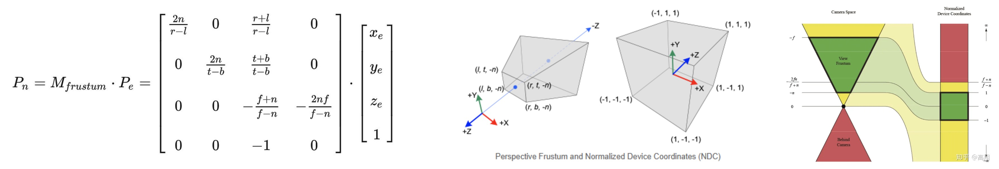

要注意的是，直接乘出来的齐次坐标，w_n等于-**z_e**，还需要对**x_n, y_n, z_n同除以w_n，即透视除法**才获得真正落在的[-1,1]^3内的坐标。

- Near ~ Far的z轴被压缩的极度不均衡，大部分都在1附近(0.9几)。非常靠近near的才会是在NDC里是负数。
- 再由视口变换变换到屏幕坐标系，做法是乘上渲染窗口的height/weight。

```C++
//Viewport transformation
for (auto & vert : v)
{
    vert.x() = 0.5*width*(vert.x()+1.0);
    vert.y() = 0.5*height*(vert.y()+1.0);
    vert.z() = vert.z() * f1 + f2;
}
```

## Assignment 2：光栅化和深度判断

### 点在三角形中

```C++
static bool insideTriangle(int x, int y, const Vector3f* _v)
{   
    // TODO : Implement this function to check if the point (x, y) is inside the triangle represented by _v[0], _v[1], _v[2]
    // _v is triangle in screen space.

    Eigen::Vector2f MA(_v[0].x() - x, _v[0].y() - y);
    Eigen::Vector2f MB(_v[1].x() - x, _v[1].y() - y);
    Eigen::Vector2f MC(_v[2].x() - x, _v[2].y() - y);

    float area1 = MA.x() * MB.y() - MA.y() * MB.x();
    float area2 = MB.x() * MC.y() - MB.y() * MC.x();
    float area3 = MC.x() * MA.y() - MC.y() * MA.x();

    return (area1 * area2 > 0.f) && (area2 * area3 > 0.f);
}
```

### 光栅化

```C++
int x_min = floor(std::min((std::min(t.v[0].x(), t.v[1].x())), t.v[2].x())); // space coord,
int y_min = floor(std::min((std::min(t.v[0].y(), t.v[1].y())), t.v[2].y()));
int x_max = ceil(std::max((std::max(t.v[0].x(), t.v[1].x())), t.v[2].x()));
int y_max = ceil(std::max((std::max(t.v[0].y(), t.v[1].y())), t.v[2].y()));

x_min = std::max(0, x_min);
y_min = std::max(0, y_min);
x_max = std::min(x_max, width - 1);
y_max = std::max(y_max, height - 1);

for(int y = y_min; y <= y_max; ++y){
    for(int x = x_min; x <= x_max; ++x){
        bool in_tri = insideTriangle(x, y, t.v);
        if(in_tri){
            float alpha, beta, gamma;
            std::tie(alpha, beta, gamma) = computeBarycentric2D(x, y, t.v);
            float w_reciprocal = 1.0/(alpha / v[0].w() + beta / v[1].w() + gamma / v[2].w());
            float z_interpolated = alpha * v[0].z() / v[0].w() + beta * v[1].z() / v[1].w() + gamma * v[2].z() / v[2].w();
            z_interpolated *= w_reciprocal;

            if(depth_buf[get_index(x, y)] > z_interpolated){
                depth_buf[get_index(x, y)] = z_interpolated;
                set_pixel(Vector3f(x, y, 0.f), t.getColor());
            }
            
        }
    }
}
```

## Assignment 3：着色器

着色器 Shader

- 顶点着色器：顶点着色器操作输入的顶点信息，如位置、法线和纹理坐标，并对它们进行变换和变形。把坐标变换到View Space，Screen Space。
- 片段着色器：片段着色器计算Screen Space每个像素的最终颜色。它可以使用纹理、光照、阴影和其他图元属性来确定像素的颜色和透明度。片段着色器通常用于实现细节和复杂的光照模型，以及处理透明度和特殊效果。
  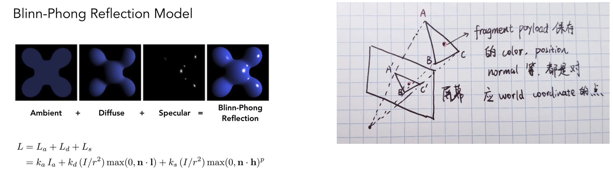

在光栅化的过程中，**遍历每一个光源**，都计算$L_a, L_d, L_s$把他们全部累加起来。$k_a，k_d，k_s$都是人为调整的参数，毕竟不是pbr。

最关键phong shader。对于屏幕空间的每个像素，都会找到他在view space的三维空间坐标，由此计算视角向量等。遍历每一个光源，累加的颜色值。

### 框架问题

```C++
Eigen::Vector3f phong_fragment_shader(const fragment_shader_payload& payload){
    Eigen::Vector3f eye_pos{0, 0, 10}; // wrong!
}
```

shader在view space进行，camera（eye）应该在原点，而不是世界坐标的(0,0,10)! 至于灯光位置，就认为他在view space吧！

## 透视修正插值

```C++
float alpha, beta, gamma;
std::tie(alpha, beta, gamma) = computeBarycentric2D(x, y, t.v);
float Z = 1.0 / (alpha / t.v[0].w() + beta / t.v[1].w() + gamma / t.v[2].w()); // w is -z. actually the depth. (postive) 
float zp = alpha * t.v[0].z() / t.v[0].w() + beta * t.v[1].z() / t.v[1].w() + gamma * t.v[2].z() / t.v[2].w();
```

不仅仅是Depth，其他属性color，texture coord，normal都需要透视修正插值。

[投影下光栅化插值方法](https://zhuanlan.zhihu.com/p/483759206)

### texture shader

把uv贴图里面的颜色取出来，作为diffuse color！

## Assignment 4：贝塞尔曲线

不是关注重点。速通

## Assignment 5：光线追踪

**光栅化**：遍历每个三角形-> (屏幕像素) ->遍历每个光源

**光线追踪**：遍历每个像素 

### Recursive Ray Tracing (Whitted Style)

Shading each intersection point (perform shading calculation here to compute color of pixel (e.g. Blinn Phong model))

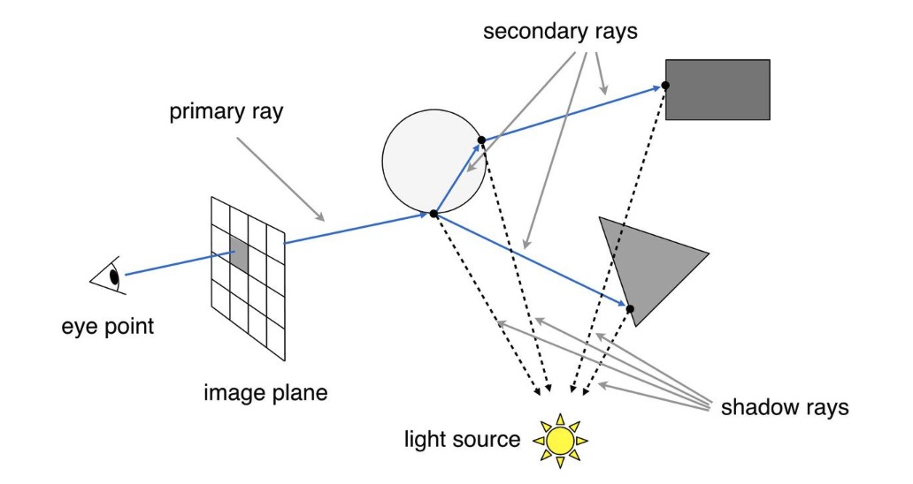

**Keypoint**: ray and triangle intersection! **需要遍历每一个三角形！**

```C++
std::optional<hit_payload> trace(
        const Vector3f &orig, const Vector3f &dir,
        const std::vector<std::unique_ptr<Object> > &objects)
{
    float tNear = kInfinity;
    std::optional<hit_payload> payload;
    for (const auto & object : objects)
    {
        float tNearK = kInfinity;
        uint32_t indexK;
        Vector2f uvK;
        if (object->intersect(orig, dir, tNearK, indexK, uvK) && tNearK < tNear)
        {
            payload.emplace();
            payload->hit_obj = object.get();
            payload->tNear = tNearK;
            payload->index = indexK;
            payload->uv = uvK;
            tNear = tNearK;
        }
    }

    return payload;
}
```

**Interesection with plane**

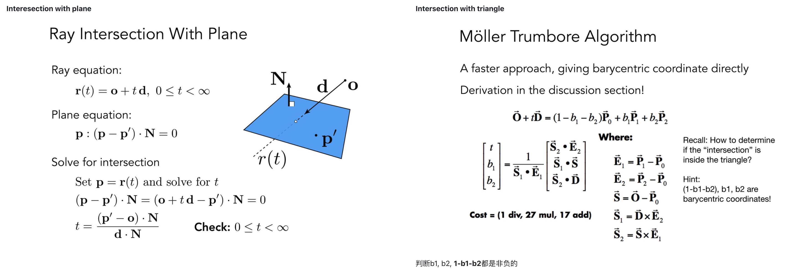

**Intersection with triangle**

判断b1, b2, **1-b1-b2**都是非负的

- 在作业里，如果光线hit 到的是REFLECTION_AND_REFRACTION或者REFLECTION材质的，则会打出secondary ray，递归计算颜色（在此处hit点没有着色，都是来自于secondary ray）。用菲涅尔方程计算反射光和透射光的占比。
- 如果是DIFFUSE_AND_GLOSSY材质，如地板，用phong模型着色。像光栅化一样，遍历每一个光源，计算shading color。其中有关键一步是判断是否在shadow里：

```C++
for (auto& light : scene.get_lights()) {
    Vector3f lightDir = light->position - hitPoint;
    // square of the distance between hitPoint and the light
    float lightDistance2 = dotProduct(lightDir, lightDir);
    lightDir = normalize(lightDir);
    float LdotN = std::max(0.f, dotProduct(lightDir, N));
    // is the point in shadow, and is the nearest occluding object closer to the object than the light itself?
    auto shadow_res = trace(shadowPointOrig, lightDir, scene.get_objects());
    bool inShadow = shadow_res && (shadow_res->tNear * shadow_res->tNear < lightDistance2);

    lightAmt += inShadow ? 0 : light->intensity * LdotN;
    Vector3f reflectionDirection = reflect(-lightDir, N);

    specularColor += powf(std::max(0.f, -dotProduct(reflectionDirection, dir)),
        payload->hit_obj->specularExponent) * light->intensity;
}

hitColor = lightAmt * payload->hit_obj->evalDiffuseColor(st) * payload->hit_obj->Kd + specularColor * payload->hit_obj->Ks;
```

关于是否在shadow里的判断，是由当前hit点往光源打出一条光线，会得到一个tNear，如果这个tNear短于到光源的距离，就是inshadow。这里很暴力，如果对于两个光源都是inshadow，直接就亮度就是0了。FEGR里面也是需要这样阴影判断。

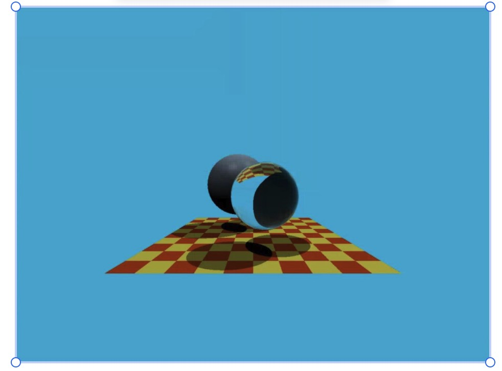

## Assignment 6：BVH加速

之前的在计算最近交点的时候，需要**遍历每一个三角形**。代价是非常高的。如果把场景划分成若干个格子，预处理知道哪些格子包含三角形。就可以先计算光线和这些格子是否相交，**如果相交了，计算是否和格子里的三角形相交。由此避免遍历所有三角形！**

AABB 相交包围盒

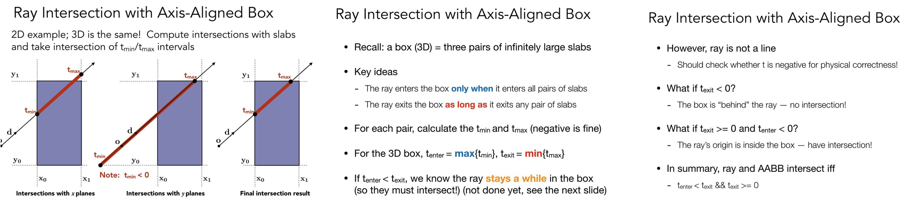

计算AABB相交的时候，box总是[pmin,pmax]，如果ray direction是负的，那么计算(p-o)/d出来的t_min和t_max需要交换一下！


BVH**从object角度(非space角度)进行划分**，每一个三角形只会落在一个包围盒内！

在代码实现的时候，叶子结点应该要调用对应object的Intersect函数！

## Assignment 7：路径追踪

Whitted-style ray tracing的一些做法（假设）不太合理。

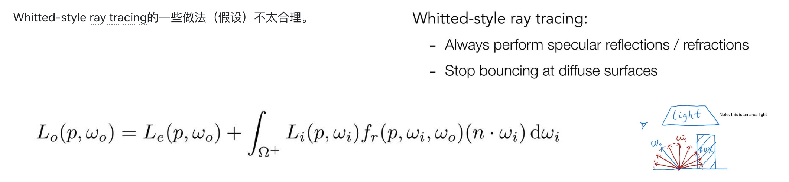

可以**随机选一个****wi****方向**， **然后计算它的****pdf**，就可以进行蒙特卡洛积分了。[一般是先给定了pdf，然后采样出wi ?]

1. 蒙特卡洛积分。 在渲染方程中，**wi****和wo我们都认为是从着色点p指向外面的向量。**
   1. 直接光照
      - 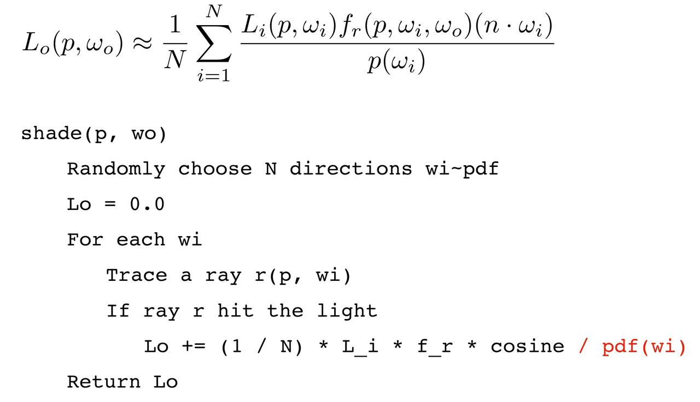
      - HDRI作为环境贴图光照的时候，Li就是从hemisphere里取出来的值！
   2. 全局光照
      - 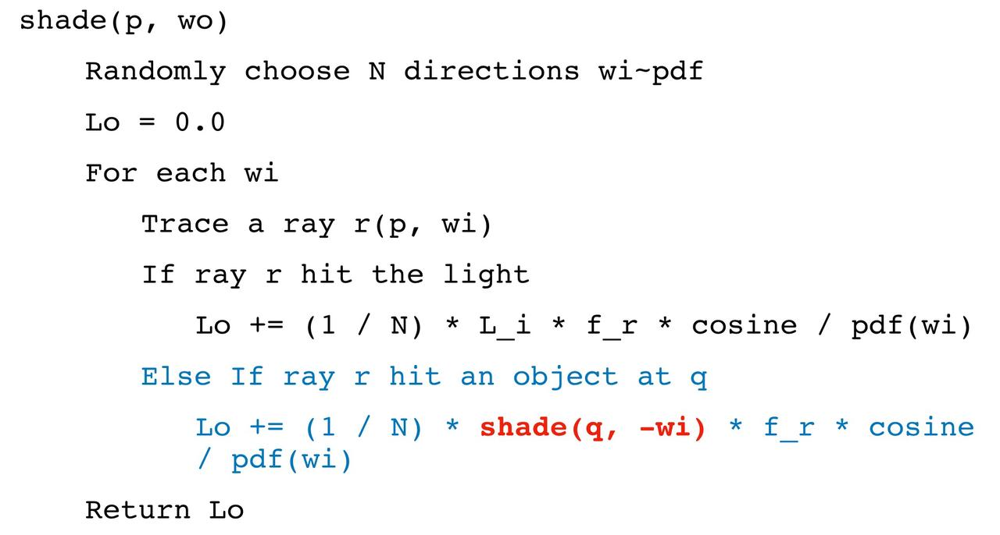
2. **问题1:** 但是全局光照的蒙特卡洛积分带来**指数级别**的shading是不可接受的。

   **现在我们只会令N=1**去做蒙特卡洛，**这就叫作路径追踪**。但是这会非常noisy，**但我们可以对同一个****pixel****多次采样平均来降噪**。**同一个pixel多次采样**不会只在像素中心射出光线，也可以在像素其他位置进行采样。
   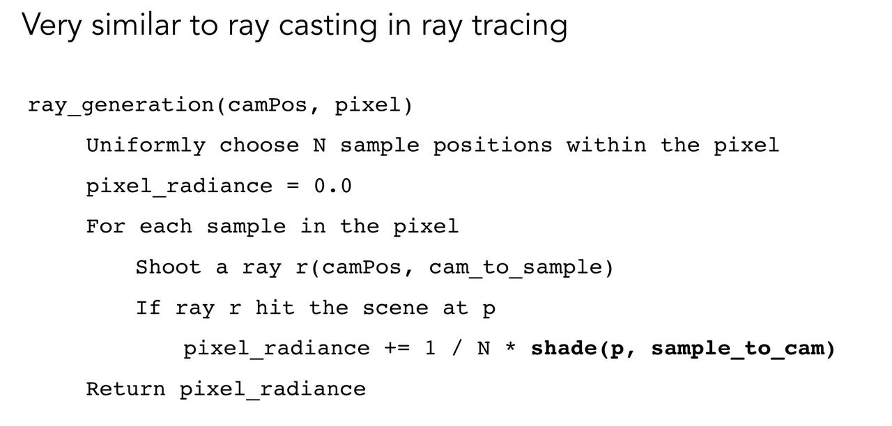
3. **问题2:** 令N=1解决了指数爆炸的问题，但是依然无法解决**递归****何时结束**的问题！
    
    用俄罗斯轮盘赌决定什么时候停下
   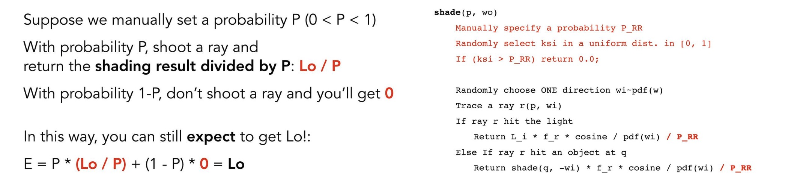
4. **问题3:** 均匀采样wi，很难打到光源，导致**直接光照采样低效！**

   蒙特卡洛积分不要求均匀采样，依据光源采样！有面积A的区域光，dA是区域光的采样概率，转化成着色点上的dw的概率即可！投影的面积就是立体角！
   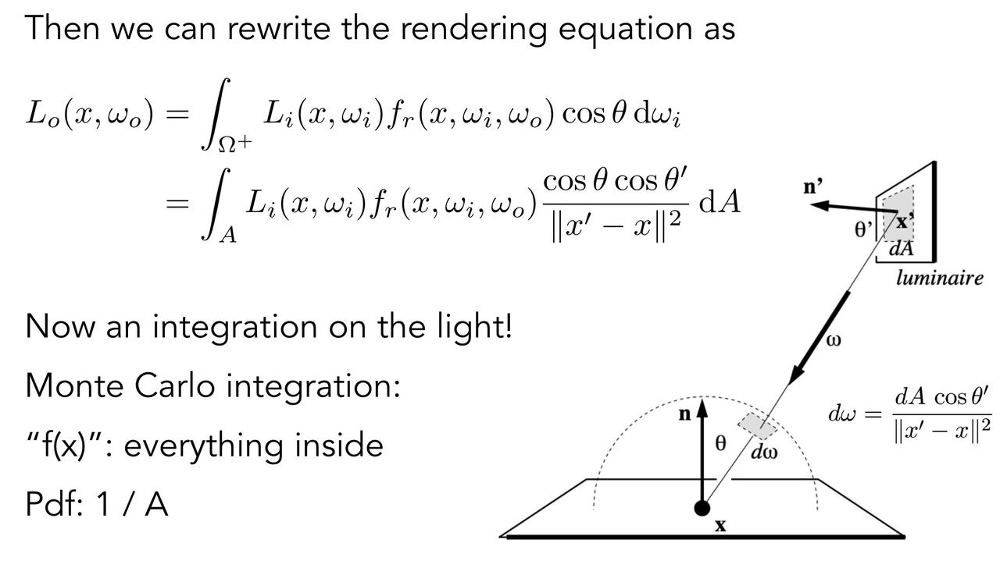
5. **完全体**：直接光照（依据光源采样）+ 间接光照（用之前方法）**分别计算！**
   1.  对于直接光照，不需要RR计算着色。
   2.  **对于间接光照，则不能是emitting的object，**会用RR计算着色。
   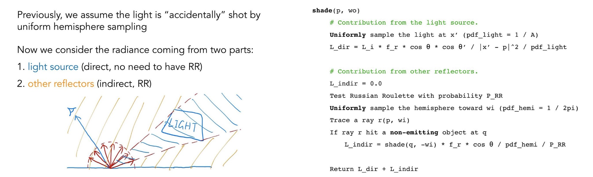
6. **超级完全体：直接光照考虑遮挡**

    用trace函数，着色点p往光源x'处打一个光线，计算closest intersection。和Assignment5的inshadow完全一致！
    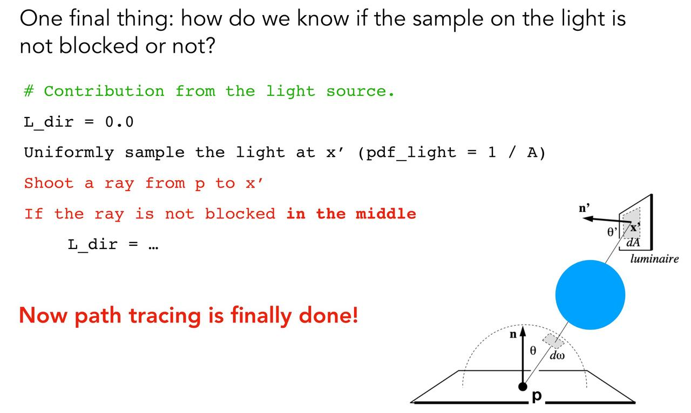

点光源很难，一般把点作成一个很小的面积光源。

### 作业部分

**AABB相交 Bounds3.hpp**

注意检查 t_enter = t_exit 的时候的判断是否正确。

这句提示其实非常关键！老师上课的时候经常提到，图形学很少关心相等的时候的条件，但是这里确实会影响到输出的结果。假如 t_enter = t_exit 时返回的是false，那么作业6并不会出任何问题，但作业7中会导致只能渲染出左侧的盒子和墙体。因此，如果你在作业6中写的是t_enter < t_exit，请务必改成**t_enter <= t_exit** 。

wo的定义可以不用管作业里说明的反转，就表示出射的direction就可以。以下是一些注意点

- line10 - line11，打到光源直接返回光源亮度！
- line22, line23 三角形的法线是向内的，可以由obj文件里，和triangle.hpp中normal初始化看出
- line32 这个epsilon据说不能太低
- line40 一开始写成大于了
- line46 简介光照必须来自非发光体
- line47 inter.m->pdf(wo, wi, N)，实际上这里包含了wi在整个sphere的情况，如果在另一个hemisphere回返回0。但是实际上wi在sample的时候就保证了在正半球。

```C++
Vector3f Scene::castRay(const Ray &ray, int depth) const
{
    // get intersection
    Intersection inter = intersect(ray);

    if(!inter.happened)
        return Vector3f(0.f,0.f,0.f);

    // Note: if hit the light, return the emission intensity!
    if(inter.m->hasEmission())
        return inter.m->getEmission();

    Vector3f L_dir(0.f, 0.f, 0.f);
    Vector3f L_indir(0.f, 0.f, 0.f);

    // get direct light 
    Intersection light;
    float pdf;
    sampleLight(light, pdf);

    Vector3f wo = - ray.direction; // direction from intersection p
    Vector3f N = normalize(inter.normal); // 朝内
    Vector3f ws = normalize(light.coords - inter.coords); // direction from intersection p
    Vector3f NN = normalize(light.normal); // 朝内

    float light_distance2 = dotProduct(light.coords - inter.coords, light.coords - inter.coords);
    float light_distance = sqrt(light_distance2);

    // if blocked
    Ray ray_to_light(inter.coords, ws);
    Intersection block_inter = intersect(ray_to_light);
    if(block_inter.distance < light_distance - 1e-3) // Note: check if blocked
        L_dir += 0;
    else
        L_dir += light.emit * inter.m->eval(wo, ws, N) * dotProduct(ws, N) * dotProduct(-ws, NN) / light_distance2 / pdf; // wo is useless

    // get indirect light 
    float RR = get_random_float();

    if(RR < RussianRoulette){
        // uniform sample from hemisphere
        Vector3f wi = inter.m->sample(wo, N); // wo is useless
        Ray ray_out(inter.coords, wi); // wi is from p

        Intersection new_inter = intersect(ray_out);
        if(new_inter.happened && !new_inter.m->hasEmission()){ // Note: must be non-emitting object 
            float pdf_hemi = inter.m->pdf(wo, wi, N); // wo is useless
            L_indir += castRay(ray_out, depth+1) * inter.m->eval(wo, wi, N) * dotProduct(wi, N) / pdf_hemi / RussianRoulette; // wo is useless
        }
    }

    return L_dir + L_indir;
}
```